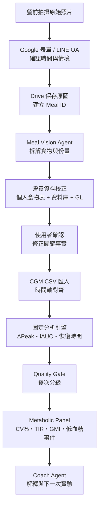

# Ai-to-Agent-CGM-v3

> 拍下一餐、對齊一條曲線、累積一套真正屬於自己的升糖地圖。

`Ai-to-Agent-CGM-v3` 是 `v1`（契約優先、CI、治理、MIT）與 `v2`（可執行原型、代謝面板、Wolever iAUC、個人食物表）的**收斂版**：以廠商中立、可驗證的資料契約為主線，把 v2 的成熟模組併入，作為可持續開發成 Web／App 的基底。

本專案採用 **AI to Agent** 思維：AI 不直接取代醫療判斷，而是把影像辨識、資料校正、固定計算、品質檢查與教練解釋拆成可驗證的工作流程。

**品牌署名：AI Coach 益力康陳董｜2026 AI to Agent**

## 0. 三個版本的關係

| | 定位 | 授權 | 在 v3 的角色 |
|---|---|---|---|
| `v1` | 規格與治理骨架（6 份文件、JSON Schema、Agent 契約、CI） | MIT | **主線基底** |
| `v2` | 可執行原型（n8n 工作流、Python 套件、代謝面板） | CC BY-SA 4.0 | 併入 3 個模組；n8n 工作流移到 `reference/` |
| `v3` | 收斂版：契約優先 ＋ v2 的成熟計算模組 | MIT | 本 repo |

從 v2 併入 v3 的三項：

1. **代謝變異與範圍面板** —— `scripts/metabolic_panel.py`（CV%、GMI、TIR/TBR/TAR、隔夜穩定度、低血糖事件）。
2. **Wolever 正解 iAUC** —— `scripts/analyze_cgm.py` 的 iAUC 改為處理跨基準線段的增量法。
3. **個人常吃食物表覆蓋** —— `scripts/apply_food_table.py` ＋ `schemas/personal-food-table.schema.json`。

## 1. v3 要驗證什麼

1. 餐點影像能否穩定轉成可確認的食物與營養資料？
2. 餐點能否可靠對齊餐後 180 分鐘 CGM 曲線？
3. 14 天內能否找到可重複、可行動的個人升糖情境？

v3 是「個人升糖規律探索系統」，不是食物實驗室、胰島素劑量工具或疾病診斷系統。

## 2. 第一可行方案

| 工作 | v3 工具 |
|---|---|
| 手機餐點紀錄 | Google 表單，或 LINE 官方帳號（見 `reference/`） |
| 原始影像保存 | Google Drive |
| 流程觸發 | Google Apps Script 或 n8n |
| 餐點辨識 | 支援影像的多模態模型（參考實作用 Gemini） |
| 營養資料校正 | 產品標示、TFDA、USDA、GI 參考資料、個人常吃食物表 |
| 人工確認 | Google 表單或 Google Sheets 待確認欄位 |
| CGM 匯入 | 原廠匯出的 CSV（參考實作用 Abbott FreeStyle Libre） |
| 指標計算 | 本專案固定 Python 分析程式 |
| 報告與洞察 | Google Sheets／Looker Studio＋Coach Agent |

不在 v3 範圍：專用手機 App、ML Kit 即時辨識、自訂 LiteRT 模型、CGM 即時 API、醫療診斷、藥物或胰島素建議。這些屬於「以本契約為基礎的後續 App 開發」，不屬於 MVP 驗證本身。

## 3. 系統架構



### 核心治理原則

- **原始資料優先**：保存未經濾鏡處理的餐點原圖與原始 CGM CSV。
- **事實由人確認**：實際進食時間、份量與隱藏糖不能只靠模型猜測。
- **計算程式化**：ΔPeak、iAUC、達峰及恢復時間、面板指標由固定程式計算並版本化。
- **AI 可被追溯**：保存模型版本、資料來源、信心與使用者修正。
- **觀察不等於因果**：單次餐點只能形成觀察，需重複或控制比較。
- **臨床安全優先**：不根據本系統自行調整藥物或胰島素；低血糖事件獨立提示。

## 4. Agent 分工

| Agent／元件 | 輸入 | 責任 | 禁止事項 |
|---|---|---|---|
| Capture Gateway | 圖片、時間、備註 | 建立 Meal ID、保存原始資料 | 不自行推定進食時間 |
| Meal Vision Agent | 原始影像、備註 | 拆解食物、估算份量範圍、標示不確定性 | 不輸出假精確值 |
| Nutrition Matching Agent | 食物拆解、產品標示、個人食物表 | 配對資料庫 ID、計算營養與 GL | 不把 GI 當個人實測反應 |
| Human Confirmation Gate | AI 推估 | 讓使用者確認高影響欄位 | 不略過低信心項目 |
| CGM Analysis Engine | CGM CSV、meal_start_at | 固定計算血糖指標與面板 | 不使用 LLM 心算 |
| Data Quality Agent | 餐次、CGM、情境 | 標記缺值、重疊、活動及異常 | 不把污染餐次列為乾淨證據 |
| Coach Agent | 已計算指標與品質標籤 | 產生白話解釋與單一變因實驗 | 不診斷、不開藥、不保證因果 |

詳細契約見 [docs/04-agent-contracts.md](docs/04-agent-contracts.md)。

## 5. 最小資料流

### 餐點紀錄

必填：原始照片、實際開始進食時間 `meal_start_at`、時區、餐別、份量參考、是否有飲料/醬汁/勾芡。
選填：進食順序、餐後活動、睡眠、壓力及特殊情況。

### 營養輸出

不應只輸出「碳水 62 克」，應輸出區間與待確認項：

```text
推估可利用碳水：55–68 g
主要來源：白飯、滷汁
信心：中等
待確認：白飯份量、滷汁是否加糖
```

### CGM 分析

- 餐前基準：`T0-15` 到 `T0-5` 分鐘的中位數
- 觀察窗：`T0` 到 `T0+180` 分鐘
- ΔPeak：餐後峰值 − 餐前基準
- Time to Peak：峰值時間 − T0
- iAUC120／iAUC180：Wolever 增量法，基準以上面積，跨基準只取上半三角形
- Recovery Time：回到基準容許範圍並維持指定時間

### 代謝面板（v3）

- 平均血糖、GMI、CV%（< 36% 穩定）、SD
- TIR 70–180、TBR < 70／< 54、TAR > 180／> 250
- 隔夜（00:00–06:00 當地時間）平均與 CV
- 低血糖事件（< 70、< 54）逐筆，獨立於餐後分析

詳見 [docs/03-clinical-analysis-protocol.md](docs/03-clinical-analysis-protocol.md)。

## 6. 14 天驗證

| 時段 | 任務 | 目的 |
|---|---|---|
| 第 1–3 天 | 正常記錄常見三餐 | 建立個人基準與修正操作流程 |
| 第 4–10 天 | 重複 2–3 種常吃主食 | 觀察相似餐次的一致性 |
| 第 11–14 天 | 每次只改一個因素 | 比較主食份量、進食順序或餐後步行 |

證據分級：L1 單次觀察／L2 相近餐食 2–3 次一致趨勢／L3 控制比較只改一個因素／L4 跨日重複驗證可納入個人規律。

## 7. 驗收標準

| 指標 | v3 目標 |
|---|---:|
| 有效餐次 | ≥30 |
| 食物大類辨識率 | ≥85% |
| 進食時間確認率 | ≥95% |
| 營養推估需修改比例 | ≤30% |
| CGM 成功對齊率 | ≥90% |
| A 級乾淨餐次 | ≥15 |
| 相似餐食重複測試 | 每類 ≥3 次 |
| 可形成行動洞察 | ≥3 項 |
| CGM 面板可產出 | 期間 CV%、TIR、GMI、低血糖事件皆有值 |

若未達標，應先修正資料品質或操作流程，不直接擴大開發範圍。

## 8. 快速執行

Python 3.10+：

```bash
python -m venv .venv
source .venv/bin/activate
pip install -r requirements.txt

# 單餐指標
python scripts/analyze_cgm.py \
  --cgm examples/cgm.csv --meals examples/meals.csv --output analysis_output.csv

# 期間代謝面板 + 低血糖事件
python scripts/metabolic_panel.py \
  --cgm examples/cgm.csv --output panel.json --events hypo_events.csv

# 個人常吃食物表覆蓋
python scripts/apply_food_table.py \
  --meal examples/meal-record.json --table examples/personal-food-table.json \
  --output meal-record.corrected.json
```

輸入與輸出格式見 [docs/02-data-contract.md](docs/02-data-contract.md)，JSON Schema 位於 `schemas/`。

執行自動化測試：

```bash
python -m unittest discover -s tests -v
```

GitHub Actions 會在每次 Push 或 Pull Request 自動執行語法、JSON、Schema、範例可重現與隱私樣式測試。

## 9. 專案結構

```text
Ai-to-Agent-CGM-v3/
├── README.md · CHANGELOG.md · VERSION · LICENSE(MIT)
├── PRIVACY.md · SECURITY.md · CONTRIBUTING.md · QUALITY_REPORT.md
├── requirements.txt
├── .github/workflows/ci.yml
├── docs/
│   ├── 01-system-architecture.md
│   ├── 02-data-contract.md          （+ Personal Food Table、Metabolic Panel）
│   ├── 03-clinical-analysis-protocol.md  （+ Wolever iAUC、面板、低血糖事件）
│   ├── 04-agent-contracts.md        （+ 食物表快速路徑）
│   ├── 05-implementation-and-acceptance.md
│   ├── 06-google-workspace-setup.md
│   └── architecture-deck.html       （v2 帶來的 12 頁總覽簡報）
├── schemas/
│   ├── meal-record.schema.json
│   ├── analysis-record.schema.json      （+ iauc_method）
│   ├── personal-food-table.schema.json  （新）
│   └── metabolic-panel.schema.json      （新）
├── prompts/
│   ├── meal-vision-agent.md
│   └── coach-agent.md
├── scripts/
│   ├── analyze_cgm.py           單餐指標（Wolever iAUC）
│   ├── metabolic_panel.py       期間面板 + 低血糖事件（新）
│   └── apply_food_table.py      個人食物表覆蓋（新）
├── tests/
│   ├── test_analyze_cgm.py
│   ├── test_metabolic_panel.py  （新）
│   └── test_apply_food_table.py （新）
├── examples/
│   ├── meals.csv · cgm.csv · meal-record.json · analysis-record.json
│   ├── personal-food-table.json     （新）
│   ├── metabolic-panel.json         （新）
│   └── meal-record.corrected.json   （apply_food_table 的示範輸出）
└── reference/
    ├── README.md               說明：這是原型接線，不是 App 後端
    └── n8n/                     v2 的 LINE × n8n × Gemini 工作流與食物表種子
```

## 10. 走向 Web／App

App 化時，主線可直接沿用：

- 後端照 `schemas/*.json` 開發，**Day 1 就用 Postgres**，不要沿用 Google Sheets。
- `scripts/` 的分析引擎維持為「吃契約、吐契約」的純函式，Web／App／批次共用同一支。
- 前端（Web 或 Flutter／React Native）只負責擷取層：拍照、確認 `meal_start_at`、一鍵校正——全部對著 `meal-record` schema。
- `reference/` 的 n8n 工作流只在單人原型期使用，**商業邏輯不留在 n8n**。

## 11. 醫療與隱私聲明

本專案僅供教育、研究、生活型態觀察與產品驗證，不構成診斷、治療或藥物調整建議。若出現持續或嚴重高低血糖、意識改變或其他急症警訊，應依所在地緊急醫療程序處理。

餐點影像與 CGM 屬敏感健康資料。公開 GitHub 時只能上傳合成、去識別或明確授權的示例資料；不得提交真實姓名、帳號、裝置識別碼、精確位置或可反推身分的原始檔案。

---

**AI Coach 益力康陳董｜2026 AI to Agent**
