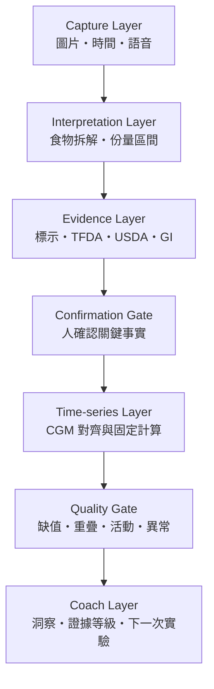

# 系統架構與 v1 邊界

## 1. 問題定義

本系統不是從照片「診斷代謝」，而是把四類證據放到同一條可追溯時間軸：

1. 這次實際吃了什麼。
2. 理論營養組成與升糖負荷為何。
3. 個人 CGM 實際發生什麼。
4. 當時有哪些活動、睡眠與餐次重疊等干擾因素。

## 2. 邏輯架構

## 3. 元件責任

### Capture Layer

- 原始餐點照片進入 Drive。
- Google 表單收集實際進食時間、時區與情境。
- 每餐建立唯一 `meal_id`。
- 原圖不可因掃描裁切或濾鏡而覆蓋。

### Interpretation Layer

- 拆解複合餐，例如滷肉飯拆成飯、肉、醬汁與配菜。
- 份量以區間呈現。
- 顯示每個項目的信心與不可見因素。

### Evidence Layer

營養資料依序選擇：產品標示／食譜、台灣資料、USDA、其他標準資料。每筆配對保存資料來源、資料 ID、版本、查詢日期、生熟重與換算方式。

### Confirmation Gate

只詢問會實質改變結果的欄位，例如主食重量、含糖飲料、醬汁及實際用餐時間。使用者修正後的資料是後續分析的權威版本。

### Time-series Layer

固定程式執行插值、基準、峰值、iAUC 與恢復計算。LLM 不參與數學計算。

### Quality Gate

每餐產生 `A_CLEAN`、`B_CONTEXTUAL` 或 `X_EXCLUDED` 標籤及原因碼，避免把污染資料當成因果證據。

### Coach Layer

只能根據已確認資料與固定程式結果解釋，並提出下一次「只改一個因素」的小型實驗。

## 4. 部署邊界

v1 可使用 Google Workspace、Apps Script／n8n 與本地或受控環境的 Python 分析。正式產品化前需重新評估身分驗證、加密、稽核、資料保留、同意管理、醫療器材法規及各 CGM 平台的授權條款。

## 5. v1 不做的事

- 不把 Google Drive 文件掃描器當食物辨識器。
- 不聲稱單張 2D 影像能精準測量克數。
- 不由 LLM 計算血糖曲線指標。
- 不以單次餐後曲線推論疾病或因果。
- 不產生胰島素、藥物或緊急醫療處置建議。

